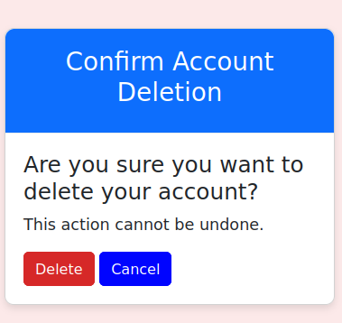
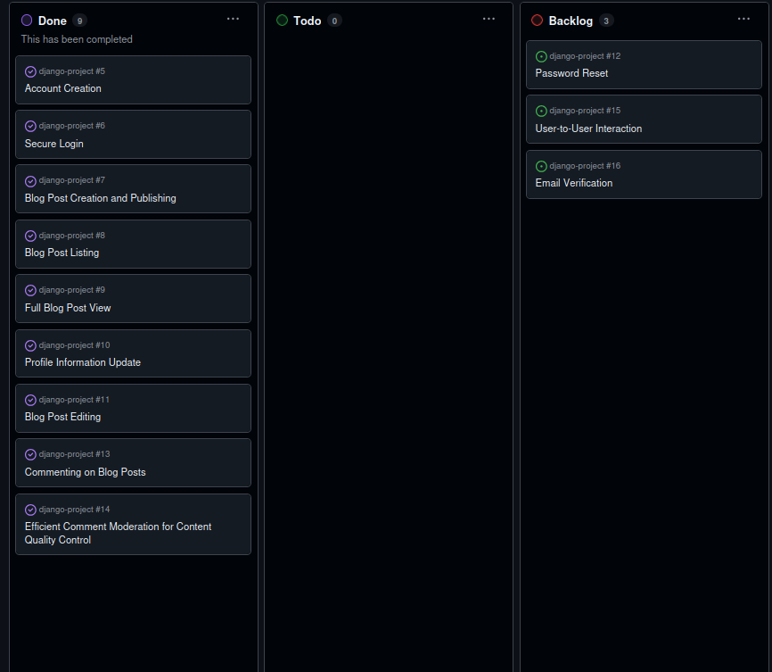

# [DJANGO PROJECT](https://dj-app-5c45ca22b6c4.herokuapp.com)

[](https://github.com/d0bledore/django-project/commits/main)
[](https://github.com/d0bledore/django-project/commits/main)
[](https://github.com/d0bledore/django-project)


source: [amiresponsive](https://ui.dev/amiresponsive?url=https://dj-app-5c45ca22b6c4.herokuapp.com)

## Modina: Your Online Second-Hand Marketplace

Welcome to Modina, the user-friendly platform that transforms your unused items into cash while helping others find great deals. 

### About Modina 

Modina is a web-based second-hand marketplace designed to connect sellers looking to declutter their homes with buyers seeking affordable, pre-loved items. Our platform makes it incredibly easy to post, browse, and purchase a wide variety of second-hand goods.

## UX

### Colour Scheme

CSS `:root` variables are used to easily update the global colour scheme by changing only one value, instead of updating it throughout the CSS file.

```css
:root {
    --primary-color: #ff0015;  
    --secondary-color: #0004ff;
    --accent-color: #a8dadc;   
    --background-color: #fce9e9;
    --text-color: #000;        
    --info-color: #457b9d;    
    --success-color: #2a9d8f;    
    --warning-color: #e9c46a;     
    --danger-color: #d62828;      
    --light-color: #ffffff;
    --dark-color: #264653;      
}
```

### Typography

- [Montserrat](https://fonts.google.com/specimen/Montserrat) is used for the primary headers on the index page.
- Roboto is used for all other secondary text.
- [Font Awesome](https://fontawesome.com) icons are used on the edit profile page.

## User Stories

### Site Visitors/Readers

- As a reader, I want to read individual blog posts in full to engage with the content.

### Site Users

- As a user, I want to leave comments on blog posts to engage with the content and share my thoughts with the author and other readers.
- As a user, I want to create an account to access personalized features of the application.
- As a user, I want to view a list of blog posts on the website to easily browse through available content.
- As a user, I want to edit my profile information to keep my personal details up to date.

### Site Contributors/Bloggers

- As a blogger, I want to create and publish new blog posts to share my content with readers.
- As a blogger, I want to edit and update my existing blog posts to make corrections or add new information.

### Site Admin

- As an admin user, I want to easily review and delete inappropriate or negative comments across the site to maintain a positive and constructive environment for our community.

## Features

### Existing Features

**Header**

- The Header is a fixed element at the top of the page, available on every page for easy navigation across the site.

    

- On the left side is a phone logo that allows the user to log in to their account (hovering over the field reveals the title info of that element). The 'Modina' logo in the middle of the header allows the user to return to the index page. On the right side is the navbar, which provides further navigation options.

- A bonus feature of this header is that the phone logo changes to an avatar when the user is authenticated.

    

- The avatar changes based on the user's gender, as registered in their account.

    

**Navbar**

- The navbar includes multiple dynamic navigation options. As an unauthenticated user, the site visitor may choose to view the site's content (view all posts), find a link to the contact form, or log in.

    

- When a site visitor is logged in, the navbar allows easy navigation to essential features such as creating a post, viewing the profile, and logging out.

    

**Index Page Questionnaire Block**

- A dynamic block on the index page with a sales purpose: to gain the attention of a site visitor and encourage them to use the site by making them realize they might have items to sell.

    

- When the site visitor completes the questionnaire, the last option is to sign up.

    

- When a user is authenticated, the questionnaire block changes to provide simple site feature navigation options.

    

**Contact Page**

- The site offers a simple contact form for users with questions, such as contacting the site admin.

    

**Django Messages**

- The site uses Django messages to confirm and inform the user of any successful actions or errors.

    

    

    

**Profile**

- Every user has a profile where they can edit user credentials, such as email, username, and password. They can also include a bio and upload a profile picture. From the profile page, the user can navigate to see all their posts and other handy navigation options such as logging out and creating a post.

    

    

**Edit Profile**

- Users can edit their account details and delete their account if desired.

    

    

**View Posts**

- The most essential feature of the site is viewing and creating posts. When a user creates a post with an image, the image is shown with the price tag on the 'posts' page.

    

- From the profile page, the user can navigate to see their own posts.

    

- Clicking on a post reveals the details of the post.

    

**Edit Posts**

- If the user is the owner of a post, clicking on their posts allows the option to edit and delete the post.

    

**Comment on a Post**

- Users can comment on a post. Site visitors who are not authenticated cannot post a comment and must log in first.

    

    

**Create a Post**

- Authenticated users can create a post. The post creation feature offers a step-by-step process with easy navigation (next & previous buttons).

    

**Create a Post: Image Preview**

- During post creation, if a user includes an image, the image is shown as a preview.

    

- If the image is not valid, the image preview will show an error and won't allow the user to continue the post creation process.

    

**Create a Post: Post Review**

- At the end of the post creation process, the user can review their post before submitting it.

    

### Future Features

#### User-to-User Interaction

Currently, users cannot interact privately with other users or see other profiles. In the future, users will have a space for private interactions (like a chat room).

#### Email Verification

Currently, the site owner has no benefit from collecting user data because it can be completely made up. Through email verification, the site can ensure that the email is legitimate and start sending updates and benefits to users.

#### Password Reset

Currently, users cannot reset their password if they forget it. In the future, users will be able to receive an email with a reset code to reset their password.

## Tools & Technologies Used

- [](https://tim.2bn.dev/markdown-builder) used to generate README and TESTING templates.
- [](https://git-scm.com) used for version control. (`git add`, `git commit`, `git push`)
- [](https://github.com) used for secure online code storage.
- [](https://code.visualstudio.com) used as my local IDE for development.
- [](https://en.wikipedia.org/wiki/HTML) used for the main site content.
- [](https://en.wikipedia.org/wiki/CSS) used for the main site design and layout.
- [](https://www.javascript.com) used for user interaction on the site.
- [](https://www.python.org) used as the back-end programming language.
- [](https://www.heroku.com) used for hosting the deployed back-end site.
- [](https://getbootstrap.com) used as the front-end CSS framework for modern responsiveness and pre-built components.
- [](https://www.djangoproject.com) used as the Python framework for the site.
- [](https://dbs.ci-dbs.net) used as the Postgres database from Code Institute.
- [](https://whitenoise.readthedocs.io) used for serving static files with Heroku.
- [](https://aws.amazon.com/s3) used for online static file storage.
- [](https://fontawesome.com) used for the icons.
- [](https://www.perplexity.ai) used to help debug, troubleshoot, and explain things.

## Agile Development Process

### GitHub Projects

[GitHub Projects](https://github.com/d0bledore/django-project/projects) served as an Agile tool for this project. It isn't a specialized tool, but with the right tags and project creation/issue assignments, it can be made to work.

Through it, user stories, issues, and milestone tasks were planned, then tracked on a weekly basis using the basic Kanban board.



## Testing

> [!NOTE]  
> For all testing, please refer to the [TESTING.md](TESTING.md) file.

## Deployment

The live deployed application can be found on [Heroku](https://dj-app-5c45ca22b6c4.herokuapp.com).

### PostgreSQL Database

This project uses a [Code Institute PostgreSQL Database](https://dbs.ci-dbs.net).

To obtain my own Postgres Database from Code Institute, I followed these steps:

- Signed in to the CI LMS using my email address.
- An email was sent to me with my new Postgres Database.

> [!CAUTION]  
> - PostgreSQL databases by Code Institute are only available to CI Students.
> - You must acquire your own PostgreSQL database through some other method if you plan to clone/fork this repository.
> - Code Institute students are allowed a maximum of 8 databases.
> - Databases are subject to deletion after 12 months.

### Amazon S3 API

This project uses the [Amazon S3 API](https://aws.amazon.com/) to store media assets online, as Heroku doesn't persist this type of data.

To obtain your own Amazon S3 API key, create an account and log in.

Ensure that you have installed `boto3` and `django-storages`, which are essential for interacting with AWS S3. These should be included in your requirements.txt file.

### Heroku Deployment

This project uses [Heroku](https://www.heroku.com), a platform as a service (PaaS) that enables developers to build, run, and operate applications entirely in the cloud.

Deployment steps are as follows, after account setup:

- Select **New** in the top-right corner of your Heroku Dashboard, and select **Create new app** from the dropdown menu.
- Your app name must be unique, and then choose a region closest to you (EU or USA), and finally, select **Create App**.
- From the new app **Settings**, click **Reveal Config Vars**, and set your environment variables.

> [!IMPORTANT]  
> This is a sample only; you would replace the values with your own if cloning/forking my repository.

| Key | Value |
| --- | --- |
| `DATABASE_URL` | user's own value |
| `AWS_ACCESS_KEY_ID` | user's own value |
| `AWS_SECRET_ACCESS_KEY` | user's own value |
| `AWS_STORAGE_BUCKET_NAME` | user's own value | 

Heroku needs two additional files in order to deploy properly.

- requirements.txt
- Procfile

You can install this project's **requirements** (where applicable) using:

- `pip3 install -r requirements.txt`

If you have your own packages that have been installed, then the requirements file needs updated using:

- `pip3 freeze --local > requirements.txt`

The **Procfile** can be created with the following command:

- `echo web: gunicorn app_name.wsgi > Procfile`
- *replace **app_name** with the name of your primary Django app name; the folder where settings.py is located*

For Heroku deployment, follow these steps to connect your own GitHub repository to the newly created app:

Either:

- Select **Automatic Deployment** from the Heroku app.

Or:

- In the Terminal/CLI, connect to Heroku using this command: `heroku login -i`
- Set the remote for Heroku: `heroku git:remote -a app_name` (replace *app_name* with your app name)
- After performing the standard Git `add`, `commit`, and `push` to GitHub, you can now type:
	- `git push heroku main`

The project should now be connected and deployed to Heroku!

### Local Deployment

This project can be cloned or forked in order to make a local copy on your own system.

For either method, you will need to install any applicable packages found within the *requirements.txt* file.

- `pip3 install -r requirements.txt`.

You will need to create a new file called `env.py` at the root-level,
and include the same environment variables listed above from the Heroku deployment steps.

> [!IMPORTANT]  
> This is a sample only; you would replace the values with your own if cloning/forking my repository.

Sample `env.py` file:

```python
import os

os.environ.setdefault("DATABASE_URL", "user's own value")
os.environ.setdefault("AWS_ACCESS_KEY_ID", "user's own value")
os.environ.setdefault("AWS_SECRET_ACCESS_KEY", "user's own value")
os.environ.setdefault("AWS_STORAGE_BUCKET_NAME", "user's own value")


# local environment only (do not include these in production/deployment!)
os.environ.setdefault("DEBUG", "True")
```

Once the project is cloned or forked, in order to run it locally, you'll need to follow these steps:

- Start the Django app: `python3 manage.py runserver`
- Stop the app once it's loaded: `CTRL+C` or `⌘+C` (Mac)
- Make any necessary migrations: `python3 manage.py makemigrations`
- Migrate the data to the database: `python3 manage.py migrate`
- Create a superuser: `python3 manage.py createsuperuser`
- Load fixtures (if applicable): `python3 manage.py loaddata file-name.json` (repeat for each file)
- Everything should be ready now, so run the Django app again: `python3 manage.py runserver`

#### Cloning

You can clone the repository by following these steps:

1. Go to the [GitHub repository](https://github.com/d0bledore/django-project) 
2. Locate the Code button above the list of files and click it 
3. Select if you prefer to clone using HTTPS, SSH, or GitHub CLI and click the copy button to copy the URL to your clipboard
4. Open Git Bash or Terminal
5. Change the current working directory to the one where you want the cloned directory
6. In your IDE Terminal, type the following command to clone my repository:
	- `git clone https://github.com/d0bledore/django-project.git`
7. Press Enter to create your local clone.

Alternatively, if using Gitpod, you can click below to create your own workspace using this repository.

[](https://gitpod.io/#https://github.com/d0bledore/django-project)

Please note that in order to directly open the project in Gitpod, you need to have the browser extension installed.
A tutorial on how to do that can be found [here](https://www.gitpod.io/docs/configure/user-settings/browser-extension).

#### Forking

By forking the GitHub Repository, we make a copy of the original repository on our GitHub account to view and/or make changes without affecting the original owner's repository.
You can fork this repository by using the following steps:

1. Log in to GitHub and locate the [GitHub Repository](https://github.com/d0bledore/django-project)
2. At the top of the Repository (not top of page) just above the "Settings" Button on the menu, locate the "Fork" Button.
3. Once clicked, you should now have a copy of the original repository in your own GitHub account!

### Local VS Deployment

While there are no visible differences in functionality between my local Django version and my deployed version on Heroku, several key differences exist:

1. **Environment Configuration**:
   - **Local**: Runs with `DEBUG = True` and often uses SQLite.
   - **Deployed**: Runs with `DEBUG = False` and typically uses PostgreSQL for better performance.

2. **Static and Media Files**:
   - **Local**: Serves static files directly from the file system.
   - **Deployed**: Requires configuration to serve static files, often using AWS S3 or Whitenoise.

3. **Deployment Process**:
   - **Local**: Uses `python manage.py runserver`.
   - **Deployed**: Code is pushed to Heroku via Git, which builds the environment.

4. **File System**:
   - **Local**: Files are saved permanently.
   - **Deployed**: Heroku has an ephemeral file system; use external services like S3 for persistent storage.

5. **Scaling**:
   - **Local**: Limited by local machine resources.
   - **Deployed**: Can scale dynamically based on traffic.

These differences ensure that while the user experience remains consistent, the underlying infrastructure is optimized for production.

## Credits

### Content

| Source | Location | Notes |
| --- | --- | --- |
| [Markdown Builder](https://tim.2bn.dev/markdown-builder) | README and TESTING | tool to help generate the Markdown files |
| [](https://www.perplexity.ai) | entire site | used to help debug and troubleshoot | 
| [WhiteNoise](http://whitenoise.evans.io) | entire site | hosting static files on Heroku |

### Media

| Source | Location | Type | Notes |
| --- | --- | --- | --- |
| [unDraw](https://undraw.co/) | entire site | image | avatar logo on header |
| [Pixabay](https://pixabay.com) | home page | image | hero image background |


### Acknowledgements

I would like to express my heartfelt gratitude to my Code Institute mentor, [Tim Nelson](https://github.com/TravelTimN), for his unwavering support and guidance throughout the development of this project. His expertise and encouragement have been invaluable.

I am also deeply thankful to the [Code Institute](https://codeinstitute.net) for providing me with this incredible opportunity to advance my career. The skills and knowledge I have gained through this program have been transformative.

Lastly, I want to extend my deepest appreciation to my partner, **Rose**, for her unwavering belief in me. Her encouragement led me to discover the Code Institute and apply for the Full-Stack Software Development Course, which has been a pivotal step in my professional journey.

Last but not least, I thank God for providing me with the strength and perseverance to complete this project, especially while managing the demands of a tough job alongside my studies.
